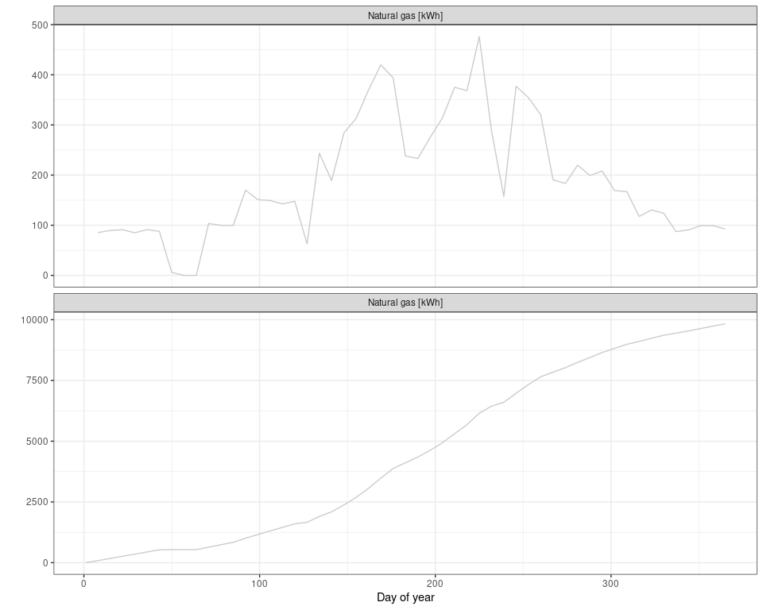
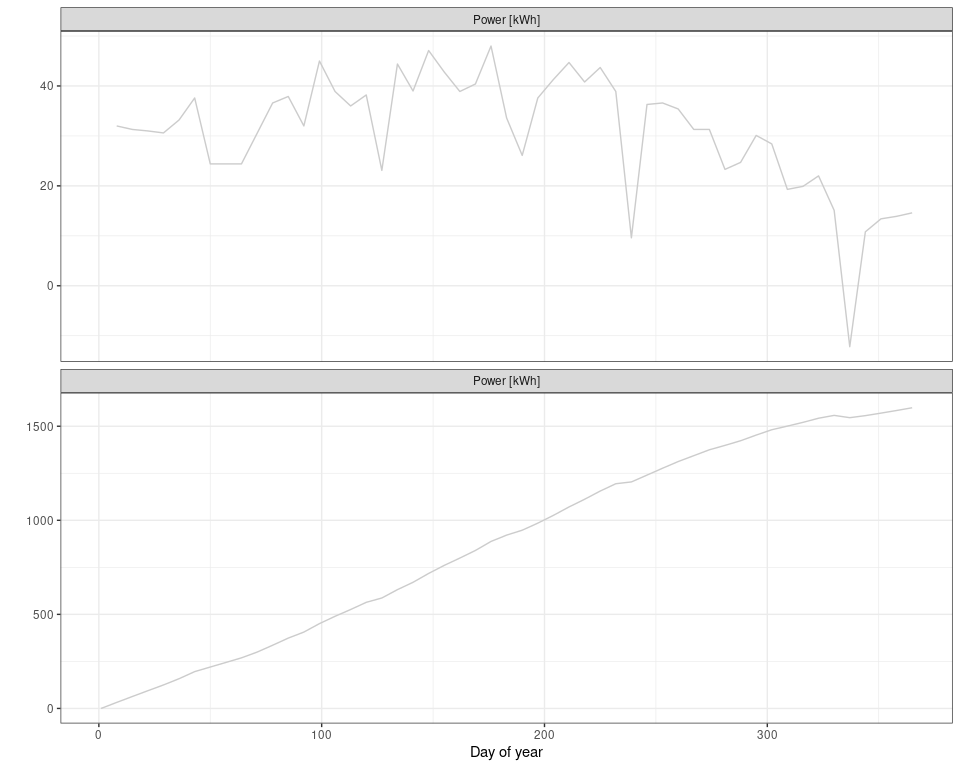

Energy monitor
================

## Introduction

Trying to reduce our private consumption of electricity and natural gas
I started to collect weekly readings from our gas and electricity meter.

Data is manually collected via a data sheet (`raw/energymonitor.ods`)
and then visualized using R and `ggplot2`.

## Data preparation

Data is imported from the spreadsheet (here LibreOffice Calc format
`ods`) as a `data.table` object, the latest (and yet empty) rows of the
template are removed and only the columns of interest are selected.

``` r
rdg = readODS::read_ods(
  "data/energymonitor.ods"
  , sheet = "data"
) |> 
  subset(!is.na(rdg_gas)) |> 
  subset(select = c("date", "rdg_gas", "rdg_pow")) |> 
  as.data.table()

rdg[, date := as.POSIXct(date, format = "%m/%d/%Y")]
rdg[, season := year(date)]
rdg[, doy := yday(date)]

rdg[
  , offset_jul := yday(
    as.Date(
      paste(
        year(date)
        , "07"
        , "01"
        , sep = "-"
      )
    )
  )
]

rdg[
  , offset_dec := yday(
    as.Date(
      paste(
        year(date) - 1
        , "12"
        , "31"
        , sep = "-"
      )
    )
  )
]

rdg[, doy := doy - offset_jul + 1L]
rdg[doy <= 0, season := season - 1L]
rdg[doy <= 0, doy := doy + offset_dec]
rdg[, c("offset_jul", "offset_dec") := NULL]

rdg[, lab := substring(date, first = 6)]
```

The gas meter records the natural gas consumption continuously in cubic
meters. To convert cubic meters readings to kWh per week one has to

- calculate the difference of successive readings
- multiply the difference with two factors, the calorific value (German:
  “Brennwert”) and the volume correction factor (German:
  “Zustandszahl”). If these are unknown, a good estimate can be achieved
  by multiplying the cubic meters with 10. In my case, I took both
  factors from the last invoice of my provider.

For electricity, consumption is recorded in kWh, so taking the
difference gives the consumption per week.

``` r
cbm2kwh = 0.9355 * 11.517 

rdg[, use_pow_kwh := c(NA_real_, diff(rdg_pow))]
rdg[, use_gas := c(NA_real_, diff(rdg_gas))]
rdg[, use_gas_kwh := use_gas * cbm2kwh]

rdg[, c("rdg_pow", "rdg_gas", "use_gas") := NULL]

rdg[, cum_pow_kwh := use_pow_kwh]
rdg[, cum_gas_kwh := use_gas_kwh]
rdg[1L, cum_pow_kwh := 0]
rdg[1L, cum_gas_kwh := 0]
rdg[, cum_pow_kwh := cumsum(cum_pow_kwh), by = season]
rdg[, cum_gas_kwh := cumsum(cum_gas_kwh), by = season]

# rdg[, sm_gas_kwh := runmed(use_gas_kwh, k = 7L, endrule = "median")]
# rdg[, sm_pow_kwh := runmed(use_pow_kwh, k = 7L, endrule = "median")]

head(rdg)
```

    ##          date season doy   lab use_pow_kwh use_gas_kwh cum_pow_kwh cum_gas_kwh
    ## 1: 2022-07-01   2022   1 07-01          NA          NA         0.0      0.0000
    ## 2: 2022-07-08   2022   8 07-08        32.0    85.28820        32.0     85.2882
    ## 3: 2022-07-15   2022  15 07-15        31.3    89.63018        63.3    174.9184
    ## 4: 2022-07-22   2022  22 07-22        31.0    91.05237        94.3    265.9708
    ## 5: 2022-07-29   2022  29 07-29        30.6    84.95420       124.9    350.9250
    ## 6: 2022-08-05   2022  36 08-05        33.2    91.37560       158.1    442.3005

## Data preparation

I’ll do two types of plots: A continuous plot of week-on-week
consumption and a accumulation per season, both for natural gas and
electricity. So, finally this ends up in 2\*2 plots.

``` r
rdg = melt(
  rdg[season == 2022]
  ,id.vars = c("date", "season", "doy", "lab")
  , measure.vars = c("use_gas_kwh", "use_pow_kwh", "cum_gas_kwh", "cum_pow_kwh")
  , value.name = "use"
  , variable.name = "type"
  , na.rm = TRUE
)
```

``` r
ggplot(
  rdg[grep("gas", x = type)]
  ,  mapping = aes(doy, y = use, color = factor(season), group = season)
) + 
  geom_line() + 
  scale_x_continuous("") + 
  scale_y_continuous("Consumption [kWh]") + 
  scale_color_manual(
    ""
    , values = c(
      "2022" = "gray80"
      , "2023" = "gray20"
    )
  ) + 
  facet_wrap(
    "type"
    , ncol = 1
    , scales = "free_y"
    , labeller = as_labeller(
      c(
        use_gas_kwh = "gas [kWh]"
        , cum_gas_kwh = "gas [kWh]"
      )
    )
  ) +
  theme_bw() + 
  theme(legend.position = "none")
```

<!-- -->

``` r
ggplot(
  rdg[grep("pow", x = type)]
  ,  mapping = aes(doy, y = use, color = factor(season), group = season)
) + 
  geom_line() + 
  scale_x_continuous("") + 
  scale_y_continuous("Consumption [kWh]") + 
  scale_color_manual(
    ""
    , values = c(
      "2022" = "gray80"
      , "2023" = "gray20"
    )
  ) + 
  facet_wrap(
    "type"
    , ncol = 1
    , scales = "free_y"
    , labeller = as_labeller(
      c(
        use_pow_kwh = "pow [kWh]"
        , cum_pow_kwh = "pow [kWh]"
      )
    )
  ) +
  theme_bw() + 
  theme(legend.position = "none")
```

<!-- -->
